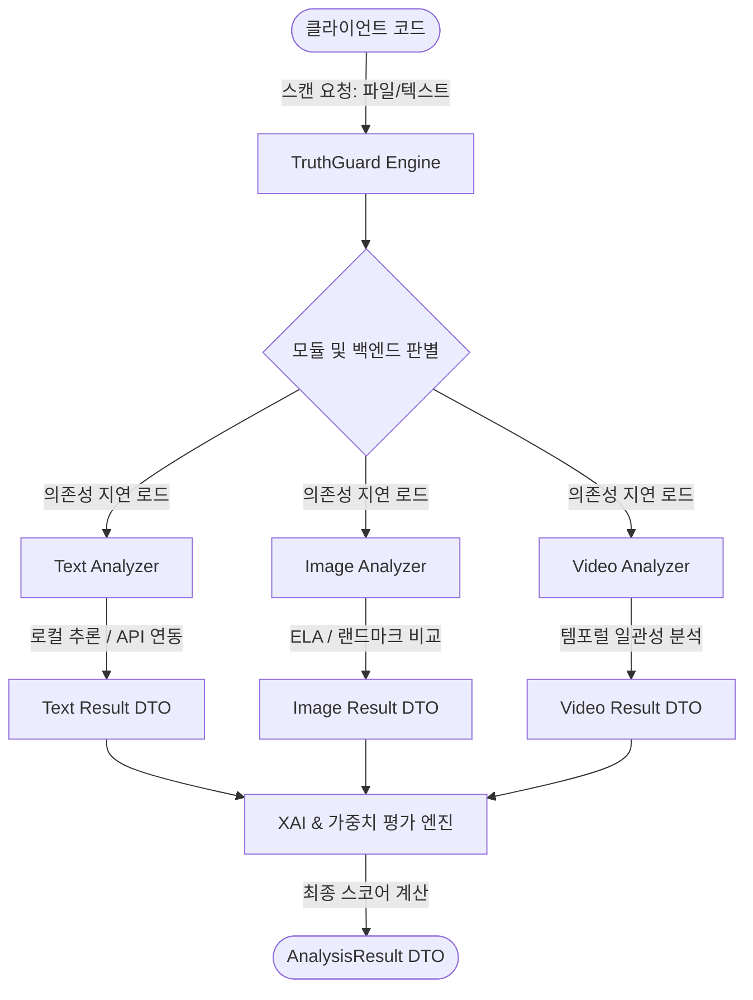

# TruthGuard SDK: 시스템 아키텍처 및 공통 설계 명세

본 문서는 TruthGuard SDK의 전체적인 파이프라인 데이터 흐름, 지연 로딩(Lazy Loading)을 응용한 모듈러 플러그인 아키텍처 설계, 그리고 공통 추상 클래스 설계의 핵심을 다룹니다.

---

## 1. 하이레벨 아키텍처 및 데이터 흐름

TruthGuard는 파일 및 스트림 콘텐츠 분석을 위한 다중 분석 모듈(Text, Image, Video, Audio)을 제공하며, 각 모듈은 동일한 인터페이스 규격을 바탕으로 병렬적으로 구동될 수 있습니다.



---

## 2. 모듈러 의존성 관리 및 지연 로딩 (Lazy Loading)

오픈소스 라이브러리로서, 이미지 처리를 위한 `opencv-python`이나 텍스트 인공지능 분석을 위한 `torch`, `transformers`는 매우 무겁습니다. 사용자가 텍스트만 스캔하는 경우 이미지/비디오 분석 모듈의 의존성이 로드되지 않도록 파이썬 `importlib`을 사용해 지연 로딩 클래스를 설계합니다.

### 2.1 지연 로드 데코레이터 및 모듈 임포터 구현 예시

```python
import importlib
import sys
from typing import Any

class LazyModuleImporter:
    """
    필요한 의존성 패키지가 없는 경우 사용자에게 적절한 install 명령어를 안내하고
    임포트를 지연시키는 도우미 클래스
    """
    @staticmethod
    def import_module(module_name: str, extra_group: str) -> Any:
        try:
            return importlib.import_module(module_name)
        except ImportError:
            print(
                f"[Error] '{module_name}' 패키지가 누락되었습니다. "
                f"이 기능을 사용하려면 다음 명령어로 추가 패키지를 설치하십시오:\n"
                f"pip install truthguard-sdk[{extra_group}]",
                file=sys.stderr
            )
            raise ImportError(f"Missing dependency for extra group: {extra_group}")
```

분석기 모듈 내부 사용 예시 (`truthguard/image/analyzer.py`):
```python
class ImageAnalyzer(BaseAnalyzer):
    def initialize_model(self) -> None:
        # cv2와 numpy, PIL이 사용되는 시점에 지연 임포트 수행
        self.cv2 = LazyModuleImporter.import_module("cv2", "image")
        self.np = LazyModuleImporter.import_module("numpy", "image")
        self.Image = LazyModuleImporter.import_module("PIL.Image", "image")
        # 실제 모델 로딩 수행...
```

---

## 3. 공통 Base 클래스 및 결과 DTO 명세

### 3.1 `AnalysisResult` 스펙
모든 하위 분석기 모듈은 다음 구조를 리턴해야 합니다. Pydantic을 활용하여 엄격한 자료형을 제약합니다.

```python
from typing import Any, Dict, List
from pydantic import BaseModel, Field

class AnalysisResult(BaseModel):
    is_manipulated: bool = Field(
        ..., 
        description="콘텐츠의 의도적 조작, 위변조, 또는 허위정보 여부 결정값"
    )
    credibility_score: float = Field(
        ..., 
        ge=0.0, 
        le=1.0, 
        description="종합 신뢰도 정량 점수 (0.0: 완전 신뢰 불가 ~ 1.0: 완벽한 정합성)"
    )
    risk_level: str = Field(
        "LOW", 
        pattern="^(LOW|MEDIUM|HIGH|CRITICAL)$",
        description="위험 위험도 레벨 분류"
    )
    ai_probability: float = Field(
        ..., 
        ge=0.0, 
        le=1.0, 
        description="AI에 의해 생성/수정되었을 가능성 확률"
    )
    analysis_details: Dict[str, Any] = Field(
        default_factory=dict, 
        description="서브 컴포넌트별 개별 점수 및 탐지 바운딩 박스 등 원본 메타데이터"
    )
    reasons: List[str] = Field(
        default_factory=list, 
        description="판정 결과의 이유 목록 (개발자 및 사용자에게 직접 텍스트로 노출)"
    )
```

### 3.2 `BaseAnalyzer` 공통 인터페이스 스펙
```python
from abc import ABC, abstractmethod
from typing import Any, Dict, List, Optional

class BaseAnalyzer(ABC):
    def __init__(self, config: Optional[Dict[str, Any]] = None):
        self.config = config or {}
        self.initialize_model()

    @abstractmethod
    def initialize_model(self) -> None:
        """
        각 서브 클래스에서 필요한 모델 및 라이브러리 초기화 로직 구현.
        """
        pass

    @abstractmethod
    def analyze(self, data: Any, **kwargs) -> AnalysisResult:
        """
        검사 행위를 지시하는 핵심 메서드.
        """
        pass

    @abstractmethod
    def supported_formats(self) -> List[str]:
        """
        스캔 지원 파일 확장자 리스트 리턴. (예: ['jpg', 'png'])
        """
        pass
```

---

## 4. 종합 스코어 가중합(Weighted Scoring) 공식

각 Analyzer가 획득한 세부 점수를 통합하여 최종 `credibility_score`를 도출하는 공식은 다음과 같이 설정합니다.

### 4.1 스코어 계산 공식
$$Score_{credibility} = 1.0 - \sum_{i=1}^{n} (w_i \times Metric_i)$$
* $Metric_i$: 탐지 모듈이 계산한 이상치/비정합성 점수 ($0.0 \sim 1.0$)
* $w_i$: 해당 이상치에 적용할 가중치 ($\sum w_i = 1.0$)

### 4.2 기본 가중치 설정 규격
| 세부 분석 모듈 | 지표명 | 기본 가중치 ($w_i$) | 위험 판정 임계점 |
| :--- | :--- | :--- | :--- |
| **텍스트** | AI 생성 확률 / 출처 미비도 | 0.4 / 0.6 | 점수 < 0.5 이면 `is_manipulated=True` |
| **이미지** | ELA 왜곡 수준 / 얼굴 딥페이크 지표 | 0.5 / 0.5 | 점수 < 0.6 이면 `is_manipulated=True` |
| **비디오** | 프레임 일관성 / 랜드마크 Jitter | 0.4 / 0.6 | 점수 < 0.65 이면 `is_manipulated=True` |
